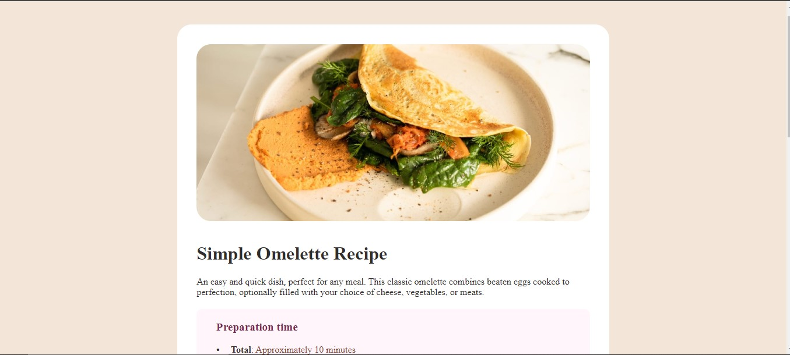

# Frontend Mentor - Recipe page solution

This is a solution to the [Recipe page challenge on Frontend Mentor](https://www.frontendmentor.io/challenges/recipe-page-KiTsR8QQKm). Frontend Mentor challenges help you improve your coding skills by building realistic projects. 

## Table of contents

- [Overview](#overview)
  
  - [Screenshot](#screenshot)
  - [Links](#links)
- [Author](#author)

## Overview

### Screenshot

### Links
- Solution URL: [Click Me](https://www.frontendmentor.io/solutions/recipe-page-main-frontendmentor-pfw5npq66k)
- Live Site URL: [Click Me](https://arjuno-008.github.io/recipe-page-main-FrontendMentor/)

## Author
- Frontend Mentor - [@ArjunO-008](https://www.frontendmentor.io/profile/ArjunO-008)
